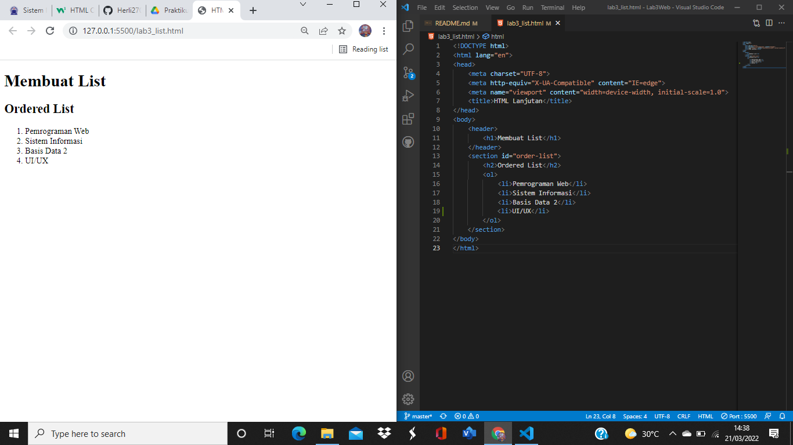
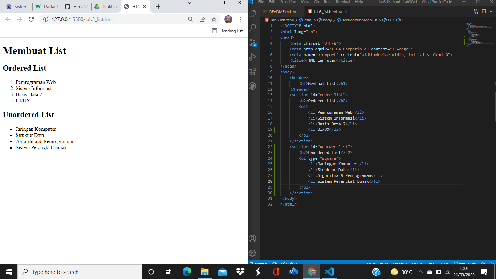
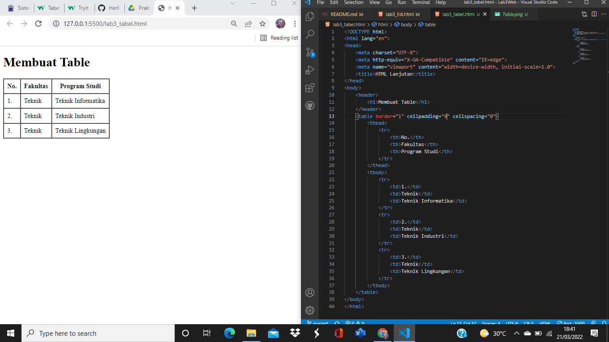

|   HERLIYANSYAH    |   312010387       |
| ----------------- | ----------------- |
|   TI.20.A.2       | PEMROGRAMAN WEB   |
| PERTEMUAN 4       |       HTML        |

## PERTEMUAN 4

Di Pertemuan kali ini kita akan mempelajari bagaimana **MEMBUAT LIST**,**TABLE** dan **FORM** dengan HTML.

## 1). LANGKAH PERTAMA MEMBUAT ORDERED LIST
### CODE DAN HASIL NYA!



**PENJELASAN**

***ORDERED LIST*** adalah **LIST** yang sudah terdaftar sesuai urutan atau **LIST** yang terurut seperti dengan tag HTML nya yaitu **ol** contoh gambar di atas,**LIST** nya terurut sesuai nomor.

**CODE HTML**
```html
<!DOCTYPE html>
<html lang="en">
<head>
    <meta charset="UTF-8">
    <meta http-equiv="X-UA-Compatible" content="IE=edge">
    <meta name="viewport" content="width=device-width, initial-scale=1.0">
    <title>HTML Lanjutan</title>
</head>
<body>
    <header>
        <h1>Membuat List</h1>
    </header>
    <section id="order-list">
        <h2>Ordered List</h2>
        <ol>
            <li>Pemrograman Web</li>
            <li>Sistem Informasi</li>
            <li>Basis Data 2</li>
            <li>UI/UX</li>
        </ol>
    </section>
</body>
</html>
```
## 2). MEMBUAT UNORDERED LIST
### CODE DAN HASIL NYA 



**PENJELASAN**

***UNORDERED LIST*** adalah **LIST** yang tidak terurut atau acak dengan tag HTML nya yaitu **ul** contoh gambar di atas yaitu ***UNORDERED LIST** **LIST** yang tidak terurut dengan 4 **li** atau **LIST** .

**CODE HTML**
```html
<section id="unorder-list">
        <h2>Unordered List</h2>
        <ul type="square">
            <li>Jaringan Komputer</li>
            <li>Struktur Data</li>
            <li>Algoritma & Pemrograman</li>
            <li>Sistem Perangkat Lunak</li>
        </ul>
    </section>
```
## 3). MEMBUAT DESCRIPTION LIST
### CONTOH CODE DAN HASIL NYA


**PENJELASAN**

**dl** atau ***Description List** adalah sebuah **LIST** yang menunjukan sebuah Deskripsi tertentu dan di dalam **dl** ada **dt** dan **dd**,**dt** sendiri adalah sebuah konten dari istilah sedangkan penjelasan nya ada di **dd** seperti itu urutan dari **dl** atau ***Description List** seperti contoh gambar di atas **dt** nya adalah nama **fakultas** sedangkan **dd** nya adalah **jurusan** .

**CODE HTML**
```html
<section id="unorder-list">
        <h2>Description List</h2>
        <dl>
            <dt>Fakultas Teknik</dt>
            <dd>Teknik Industri</dd>
            <dd>Teknik Informatika</dd>
            <dd>Teknik Lingkungan</dd>
            <dt>Fakultas Ekonomi dan Bisnis</dt>
            <dd>Akuntansi</dd>
            <dd>Manajemen</dd>
            <dd>Bisnis Digital</dd>
        </dl>
    </section>
```

## 4). MEMBUAT TABEL 
### CONTOH CODE DAN TAMPILAN DI BROWSER NYA


**PENJELASAN**

***TABLE*** dalam HTML terdiri atas **thead** untuk ***table*** head dan kemudian ***tr*** untuk membuat ***table row*** dan di dalam **thead** ada ***th*** untuk table head nya,sementara untuk **tbody** yaitu table body sama harus di awali ***tr*** dan kemudian disusul **td** yaitu **table data** atau isi Deskripsi sebuah table,Seperti contoh gambar di atas lengkap dengan susunan dalam membuat ***Table***.

**CODE HTML**
```html
<!DOCTYPE html>
<html lang="en">
<head>
    <meta charset="UTF-8">
    <meta http-equiv="X-UA-Compatible" content="IE=edge">
    <meta name="viewport" content="width=device-width, initial-scale=1.0">
    <title>HTML Lanjutan</title>
</head>
<body>
    <header>
        <h1>Membuat Table</h1>
    </header>
    <table border="1" cellpadding="4" cellspacing="0">
        <thead>
            <tr>
                <th>No.</th>
                <th>Fakultas</th>
                <th>Program Studi</th>
            </tr>
        </thead>
        <tbody>
            <tr>
                <td>1.</td>
                <td>Teknik</td>
                <td>Teknik Informatika</td>
            </tr>
            <tr>
                <td>2.</td>
                <td>Teknik</td>
                <td>Teknik Industri</td>
            </tr>
            <tr>
                <td>3.</td>
                <td>Teknik</td>
                <td>Teknik Lingkungan</td>
            </tr>
        </tbody>
    </table>
</body>
</html>
```
## 5). MENGATUR MARGIN DAN PADDING PADA TABLE
Sebelum nya saya memberi cellpadding="4" dan cellspacing="0" 
**CODE SEBELUM NYA** 
```html
 <table border="1" cellpadding="4" cellspacing="0">
```
dan saya ubah ke cellpadding="8" dan cellspacing="0" 
**CODE SETELAH DIUBAH**
```html
<table border="1" cellpadding="8" cellspacing="0">
```   
maka tampilan di browser nya seperti gambar dibawah!
 
Untuk menambahkan margin dan padding pada  cell data tambahkan atribut **cellpadding** dan **cellspacing** seperti gambar di atas saya merubah padding nya agar terlihat ke dalam.